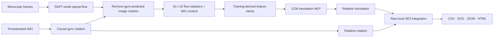

# CompactVIO-UAV

**Estimate a local 3D trajectory from synchronized monocular camera and IMU data.**

[](https://github.com/laxman-kc/compact-vio-uav/actions/workflows/ci.yml)

CompactVIO-UAV is an offline visual-inertial odometry research project. The current runnable
pipeline combines RAFT optical flow, gyro integration, and a compact learned translation head,
then exports an inspectable trajectory as CSV, SVG, JSON, and HTML.

> [!WARNING]
> The software runs end to end, but the current model is **experimental and rejected for accurate
> odometry**. It passed two development sequences and failed the separate held-out test on distance
> scale and long-horizon drift. Do not use it for navigation, control, or measurement.

## Start here

Choose the path that matches what you want to do:

| Goal | Start with |
|---|---|
| Run the local web demo | [Getting started](docs/getting-started.md) |
| Prepare camera + IMU inputs | [Input formats](docs/input-formats.md) |
| Understand a result | [Understanding the output](docs/interpreting-results.md) |
| Inspect the model and evidence | [Model card](docs/model-card.md) |
| Work on the repository | [Contributing](CONTRIBUTING.md) and [repository layout](docs/repository-layout.md) |

### Current local run

Install the demo dependencies:

```bash
python3 -m venv .venv
source .venv/bin/activate
python -m pip install -e '.[demo]'
```

If you already have the checked local model package, launch the app:

```bash
compact-vio-demo \
  --model-package outputs/raft-hybrid-experimental-20260830/model-package/manifest.json
```

Open `http://127.0.0.1:7860`, then either run the built-in workflow example or upload one recording
bundle ZIP.

> [!NOTE]
> A fresh clone does **not** contain the model package. The weights are intentionally Git-ignored,
> and no rights-reviewed public download exists yet. The repository can be installed, tested, and
> inspected from a clean clone; inference requires a locally built package. Publishing a verified
> package is a release blocker, not a hidden setup step.

## What the current runtime does

- Reads timestamped monocular images and synchronized six-axis IMU samples.
- Estimates relative translation and rotation for each camera pair.
- Integrates the motion into a raw local 6-DoF trajectory starting at identity.
- Writes `trajectory.csv`, `trajectory.svg`, `summary.json`, and `summary.html`.
- Separates **run completed** from **model accuracy** in both the UI and result files.
- Exports and verifies the compact translation head with ONNX Runtime.

It does not produce GPS coordinates, a global map, loop closure, or a flight-control signal. The
full image + IMU pipeline is not a single ONNX graph.

| Capability | State today |
|---|---|
| Recording bundle → local trajectory | Implemented |
| Web demo and command-line runner | Implemented |
| CSV, SVG, JSON, and HTML results | Implemented |
| Translation-head ONNX export | Implemented and parity checked |
| Public model download | Blocked by release/licensing work |
| Held-out odometry quality | Rejected: distance scale and drift failed |
| Full pipeline ONNX, Jetson, ROS 2, PX4 | Future work |

## Current model



The output is expressed in the local IMU sensor frame. Uploaded recordings normally have no
ground truth, so the app can confirm that processing finished but cannot claim the trajectory is
accurate.

## Evaluation result

All rows use complete pair coverage and raw trajectories without alignment, scale fitting,
smoothing, GPS correction, or loop closure.

| Sequence | Role | ATE vs zero motion | Estimated/reference path | End drift | Verdict |
|---|---|---:|---:|---:|---|
| V1_03 difficult | Development | 0.688 / 2.208 m | 69.3 / 78.9 m (87.8%) | 1.23% | Pass |
| V2_03 difficult | Development | 1.479 / 2.056 m | 73.3 / 86.0 m (85.2%) | 1.77% | Pass |
| MH_03 medium | Held-out final | 3.825 / 4.674 m | 69.5 / 130.7 m (53.2%) | 3.28% | **Fail** |

The held-out result improved over zero motion on ATE and pairwise translation/rotation error, but
it underestimated distance by **46.8%** and exceeded the frozen 2% drift limit. The packaged
candidate is therefore labeled `experimental_rejected`. See the [model card](docs/model-card.md)
for the complete gate and intended-use statement.

## Command-line run

```bash
compact-vio-run \
  --recording /path/to/timestamped-frames \
  --imu /path/to/imu.csv \
  --calibration /path/to/calibration.json \
  --model-package /path/to/model-package/manifest.json \
  --output outputs/my-recording \
  --device cpu
```

MP4 input also needs `--camera-timestamps`. CUDA is recommended for RAFT performance; CPU is the
portable example and can be slow. See the [CLI reference](docs/cli-reference.md) for the complete
command map.

## Current runtime vs historical research

The repository preserves two model lanes:

- **Current runnable lane:** RAFT-small + causal gyro + compact translation MLP. It has package,
  inference, demo, and head-ONNX tooling. Its original remote experiment scripts are not yet a
  polished public training pipeline.
- **Historical learned lane:** image-pair CNN + IMU encoder + recurrent fusion experiments. The
  `compact-vio-train`, `compact-vio-evaluate-trajectory`, `compact-vio-export-inference`, and
  `compact-vio-export-onnx` commands belong to this lane.

Keeping those lanes explicit avoids suggesting that the legacy trainer reproduces the current
RAFT-hybrid package. See [Training](docs/training.md), [Evaluation](docs/evaluation.md), and
[ADR-0007](docs/adr/0007-raft-gyro-hybrid-runtime.md).

## Repository map

| Path | Purpose |
|---|---|
| `src/compact_vio/` | Runtime, model, data, evaluation, and research code |
| `tests/` | Unit, contract, parser, package, and CLI tests |
| `docs/` | Current guidance, architecture, ADRs, protocols, and history index |
| `configs/` | Versioned machine-consumed data, training, evaluation, and schema inputs |
| `reports/` | Dated human-readable experiment results |
| `governance/` | Rights, provenance, authorization, and receipt records |
| `experiments/` | Experiment evidence schemas and bundles |
| `environments/` | Reproducible execution-environment records |
| `examples/` | Rights-cleared workflow examples and usage notes |

Detailed ownership rules are in [Repository layout](docs/repository-layout.md).

## Documentation

- [Documentation home](docs/README.md)
- [Getting started](docs/getting-started.md)
- [Input formats](docs/input-formats.md)
- [Understanding the output](docs/interpreting-results.md)
- [Model card](docs/model-card.md)
- [Current architecture](docs/architecture.md)
- [CLI reference](docs/cli-reference.md)
- [Training](docs/training.md)
- [Evaluation](docs/evaluation.md)
- [Architecture decisions](docs/adr/README.md)
- [Research reports](reports/README.md)

## Release status

The shortest path to a usable research release is:

1. select a source license and confirm redistribution terms for model assets;
2. publish a versioned, checksum-pinned model package and sample bundle;
3. add a clean-clone inference smoke test using those released assets;
4. improve distance and drift generalization on an untouched sequence;
5. treat Jetson, ROS 2, PX4, and physical hardware as a later phase.

## Research context

CompactVIO-UAV is not a faithful reproduction of one paper. It is a project-specific hybrid
pipeline informed by visual-inertial odometry and learned motion-estimation research. Related
systems include [OpenVINS](https://github.com/rpng/open_vins),
[Kimera-VIO](https://github.com/MIT-SPARK/Kimera-VIO),
[ORB-SLAM3](https://github.com/UZ-SLAMLab/ORB_SLAM3),
[VINS-Fusion](https://github.com/HKUST-Aerial-Robotics/VINS-Fusion), and
[DROID-SLAM](https://github.com/princeton-vl/DROID-SLAM).

## License, contribution, and safety

This is a publicly readable research repository. No source license has been selected, so public
visibility does not grant open-source reuse or redistribution rights. External pull requests are
not accepted until that decision is complete; discussion issues are welcome. Third-party datasets,
TorchVision weights, and generated model artifacts retain their own terms.

See [Contributing](CONTRIBUTING.md), [Security](SECURITY.md), and
[ADR-0001](docs/adr/0001-project-and-release-scope.md). Never use the current model for vehicle
control, navigation, obstacle avoidance, safety decisions, or physical flight.
