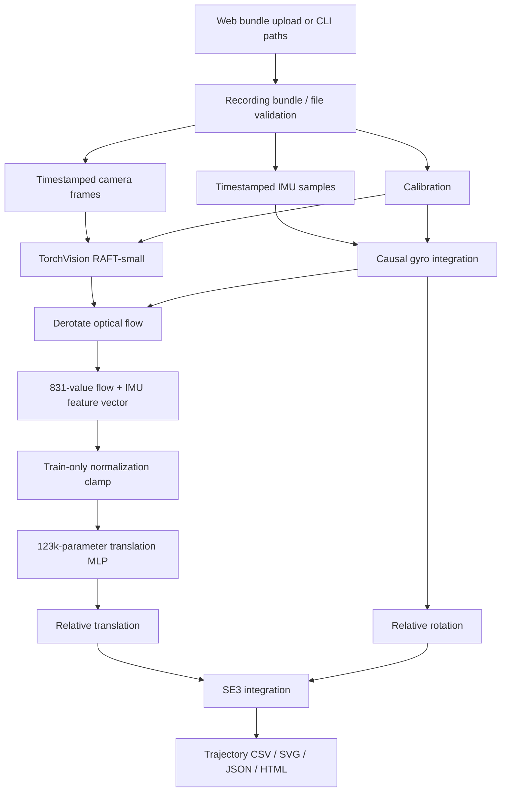

# Current architecture

This document describes the code path a user can run today. Historical learned-model experiments,
operational evidence, and future deployment ideas live in the dated reports, ADRs, plan, and
progress ledger.

## Product boundary

Input:

- one timestamped monocular camera stream;
- one synchronized six-axis IMU stream;
- camera intrinsics, distortion, and camera-to-IMU calibration;
- a checked local model package.

Output:

- a raw local 6-DoF trajectory starting at identity;
- CSV, SVG, JSON, and HTML artifacts;
- separate execution and model-quality statuses.

The current system is offline local odometry. It does not perform mapping, loop closure,
relocalization, GPS fusion, ROS/PX4 integration, control, or flight.

## End-to-end data flow

## User-facing surfaces

| Surface | Entry point | Purpose |
|---|---|---|
| Local web app | `compact-vio-demo` | One-click example, one-file bundle upload, readable results |
| Recording runner | `compact-vio-run` | Scriptable file/directory inference |
| Hybrid packager | `compact-vio-package-raft-hybrid` | Validate and bind runtime artifacts |
| Head ONNX export | `compact-vio-export-raft-head-onnx` | Export/check the translation head |

The similarly named `compact-vio-train`, `compact-vio-evaluate-trajectory`,
`compact-vio-export-inference`, and `compact-vio-export-onnx` commands operate on the historical
CNN/GRU model. They do not train or reproduce the current RAFT-hybrid package. The current hybrid
has runtime, packaging, and head-export code, while its original training/evaluation scripts remain
experiment artifacts rather than a public command surface.

The web app and CLI call the same `run_recording` function. The UI does not have a second model
implementation.

## Input layer

`compact_vio.learning.demo_bundle` provides the simple one-ZIP UX. It validates member paths,
types, duplicates, sizes, compression ratios, and the required payload before extracting into a
temporary directory. Extracted files still pass through the normal loaders.

`compact_vio.learning.recording_inference` provides:

- camera timestamp parsing;
- safe image-ZIP extraction and optional MP4 decoding;
- canonical/short/EuRoC IMU parsing;
- JSON/YAML calibration loading;
- exact frame/IMU pairing;
- SE(3) trajectory integration;
- artifact generation and plain-language quality reporting.

## Current model package

`compact_vio.learning.raft_hybrid` loads a strict package that binds:

- TorchVision RAFT-small `C_T_V2` weights;
- the stateless translation-head checkpoint;
- the training-derived feature clamp applied during inference;
- translation-head ONNX and its checked sidecar;
- input, calibration, feature, and output contracts;
- frozen evaluation summary and rejected quality status.

The runtime preserves raw image paths, native timestamps, and calibration until feature extraction.
This is necessary because the hybrid frontend cannot be reconstructed from the legacy resized
tensor API.

## Model computation

For each consecutive camera pair:

1. rectify frames using the declared pinhole/radtan calibration;
2. run 12-update RAFT-small optical flow;
3. integrate the causal IMU gyro window after bias initialization;
4. remove gyro-predicted image rotation from flow;
5. aggregate mean, standard deviation, and validity over a 10 × 16 grid;
6. append fixed IMU/time context to produce 831 features;
7. normalize and clamp features to train-observed ranges;
8. predict previous-IMU-frame translation with the compact MLP;
9. combine it with gyro rotation and integrate the local pose.

The MLP is `831 → 128 → 128 → 3` with GELU activations and 123,395 trainable parameters.

## Coordinate and timing contract

- Camera and IMU timestamps are non-negative nanoseconds and strictly increasing.
- Each motion step uses two consecutive camera frames and its causal IMU interval.
- The IMU stream must include stationary pre-roll before the first frame for gyro-bias
  initialization.
- The current package requires identity `imu.T_BS`.
- Relative translation and rotation are expressed in the previous IMU sensor frame.
- Poses start at local identity and are integrated without global alignment or loop closure.

## Results and trust

An ordinary upload has no reference trajectory. The runtime can prove that processing succeeded,
but it cannot prove that the estimated path is accurate.

The package therefore carries a frozen benchmark summary. The UI exposes its result separately:

- 2/2 development sequences passed;
- the 1/1 held-out final sequence failed path scale and normalized drift;
- package quality is `experimental_rejected`.

See the [model card](model-card.md) for metrics and intended use.

## ONNX boundary

The translation head alone exports to ONNX. The exporter includes feature clamp and any declared
post-head matrix, validates the graph contract, and checks PyTorch/ONNX Runtime parity.

RAFT, image calibration/rectification, timestamped gyro integration, feature construction, and
trajectory integration are not in that graph. “Head ONNX complete” must not be described as a
full image-to-trajectory ONNX model.

## Historical architecture

[ADR-0004](adr/0004-primary-research-contribution.md) defined the original learned CNN + IMU
encoder + recurrent fusion prototype. Those experiments remain reproducible and are not erased.
The current runnable package is the later RAFT + gyro + compact translation-head architecture
accepted in [ADR-0007](adr/0007-raft-gyro-hybrid-runtime.md).

## Future boundary

The next offline-model step is better distance/drift generalization on untouched data. Jetson,
TensorRT/full-pipeline export, ROS 2, PX4, SITL/HIL, and physical flight are a later deployment
phase and remain unresolved in [ADR-0006](adr/0006-deployment-scope.md).
