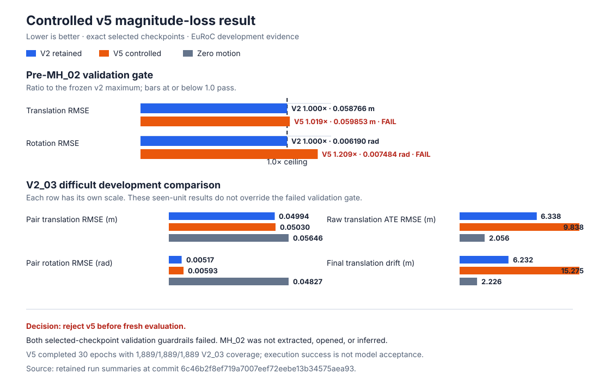

# EuRoC compact VIO v5 controlled magnitude-loss result

Review date: 2026-08-28

Status: Completed run; failed frozen pre-`MH_02_easy` validation gate and
rejected

## Result identity

- Code revision: `6c46b2f8ef719a7007eef72eebe13b34575aea93`
- GitHub Actions:
  [run 33173750012](https://github.com/laxman-kc/compact-vio-uav/actions/runs/33173750012),
  successful
- Experiment: `euroc-compact-vio-v5-magnitude`
- Execution: deterministic 30-epoch AMP run on one NVIDIA A10 with PyTorch
  `2.7.0`
- Training configuration:
  `configs/training/euroc_compact_vio_v5_magnitude.json`
- Checked-in source training-configuration SHA-256:
  `7f5e50785ed1907c26f5bbea6766a4fc13fd3df591c8930ef8b15ac9f7d71af0`
- Canonical resolved runtime-configuration SHA-256:
  `228e48f0cce2882a7f4b066bb6eda0293d6cd5a4a7dfd478c4cbaf7413aebd93`
- Resolved evaluation-configuration SHA-256:
  `ea3589b4434f35a1ce9306e9d43818b95bf8e174a74eaed9a69fcc45ac4edacd`
- Governed environment-record SHA-256:
  `12a280c9dd1759d20a41e93f06a0935e7f62f7ecee8cc08d3f7e3f5056fbfc11`
- Dataset: EuRoC MAV, DOI `10.3929/ethz-b-000690084`
- Split manifest: `configs/data/euroc_vicon_v1.json`
- Split-manifest SHA-256:
  `96d609aca0877b8b37f78498df01cf28f66ba9458a7b9849c1e8cad035b789a0`
- Training membership: `V1_02_medium`, `V2_01_easy`, `V2_02_medium`
- Validation membership: `V1_03_difficult`
- Configured development-test membership: `V2_03_difficult`
- Inference state policy: `zero-per-independent-pair/v1`
- Rotation state source: `shared-recurrent-fusion-state/v1`
- Raw trajectory metric: `se3/raw-no-alignment/exact-sequence-pairs/v1`
- Selected checkpoint SHA-256:
  `f26267f2cb55962ba236257acda0a7ac97ad87f93ae0ecdcb585026fa21f0741`
- Original trainer-output artifact-manifest SHA-256:
  `9628a7b93da229700b07aa9bb43c07e8b31f68bd4e9ee764b4d7ad06ac63b2f9`
- Governed run-manifest SHA-256:
  `aeeb4f573d7dcf590f4f0aaf3fd49e922498ec5e2c465fd87e7c00aabf272af4`
- Governed outer artifact-manifest SHA-256:
  `548fd52ffd0d89e4a7d347c78a8e9c4ba799c84dd74f7e0a6f3a365f0ba3b91e`

The execution revision passed all 351 A10 tests. A structural two-epoch smoke
at
`/home/ubuntu/compact-vio-runs/euroc-compact-vio-v5-magnitude-smoke-6c46b2f`
used 128 training and 64 validation examples, selected and produced 64 of the
1,889 eligible configured test pairs, completed in `16.68084` seconds, and
wrote checkpoint SHA-256
`56d307755a1203a2e3d2798dee02d07dc7a9d8c85b478dd04f15ba6a84db309e`.
That smoke established structural execution only; it was not quality evidence.

The full run used this exact module invocation from the clean repository root:

```bash
PYTHONPATH=src python3 -m compact_vio.learning.cli \
  --config configs/training/euroc_compact_vio_v5_magnitude.json \
  --data-root /home/ubuntu/datasets/euroc/sequences \
  --output-dir /home/ubuntu/compact-vio-runs/euroc-compact-vio-v5-magnitude-full-6c46b2f \
  --device cuda
```

The governed environment record binds Linux `6.8.0-60-generic` x86-64,
Python `3.10.12`, PyTorch `2.7.0`, CUDA `12.8`, cuDNN `90800`, Pillow
`12.3.0`, PyYAML `6.0.3`, NVIDIA driver `570.148.08`, one 23,696,375,808-byte
NVIDIA A10, 30 Intel Xeon Platinum 8358 vCPUs, and 238,546,477,056 bytes of
worker memory. It was captured immediately after the run on the same clean
revision and is explicitly labelled a post-run observation rather than a
container digest.

## Frozen decision and observed result

The prospective control record froze two selected-v2 validation limits before
the run. Both had to pass before any `MH_02_easy` extraction or inference.

| Pre-fresh-evaluation gate | Frozen maximum | V5 selected value | Outcome |
|---|---:|---:|---|
| Validation translation RMSE | `0.058765891780989885` m | `0.05985308049522323` m | Fail |
| Validation rotation RMSE | `0.0061899144990098035` rad | `0.007484109588922632` rad | Fail |

The run itself completed successfully from
`2026-08-28T13:05:56.866718Z` through
`2026-08-28T13:13:04.921466Z`, a recorded duration of
`428.054755853` seconds, and selected epoch 29. “Completed” describes execution
status only. Because both validation values were greater than their frozen
limits, the mechanical decision is **reject v5**.



No retry, loss change, threshold change, checkpoint substitution, or tuning was
performed. `MH_02_easy` was never extracted, opened, or used for inference, so
it was not consumed by this candidate. V5 did not proceed to fresh evaluation,
inference export, model promotion, target deployment, ROS/PX4 work, or flight
work.

## Configured development-test diagnostics

The full training command still emitted its frozen `V2_03_difficult`
development-test diagnostics. That sequence had already informed v1-v4 and the
v5 hypothesis; these numbers are not fresh confirmation and cannot override the
validation rejection.

- Coverage was complete for the configured test: 1,889 eligible, 1,889
  selected, and 1,889 produced pairs.
- Pair translation RMSE was `0.05030155673706295` m.
- Pair rotation RMSE was `0.0059332330310097135` rad.
- Raw no-alignment translation ATE RMSE was `9.837654824915393` m.
- Final translation drift was `15.275065744781154` m.
- Predicted path length was `63.33375191024651` m versus
  `85.98933047434808` m reference path length.
- The same-sequence zero-motion control had raw translation ATE RMSE
  `2.0557175228736244` m and final translation drift
  `2.2264894226373304` m.

The A10 inference scope was
`predict-batch-model-placement-eval-host-to-device-forward-and-device-to-host`.
Across 30 batches it recorded `5297.563199630622` pairs/s,
`0.35657903998799156` seconds total, batch-latency p50/p95 of
`8.262460003606975`/`14.250628999434412` ms, and CUDA peak
allocated/reserved memory of `267884544`/`322961408` bytes. It used no
dedicated warmup batch. This is an A10 development measurement, not an
embedded-target benchmark.

## Retained evidence

The original five-file trainer output and its immutable inner manifest are
preserved inside a canonical governed-v2 wrapper. The wrapper adds the
schema-valid `run-manifest.json`, resolved training and evaluation
configurations, exact split/acquisition/registry copies, a post-run environment
observation, and an execution record. It is retained as ignored local evidence at
`outputs/euroc-compact-vio-v5-magnitude-governed-v2-6c46b2f`. Governed-bundle
validation passed there with no missing, unexpected, size-mismatched, or
hash-mismatched file. The outer inventory binds 14 payload files, the run
manifest classifies 13 artifacts, and nested trainer verification covers five
payloads. Those payloads total 37,075,047 bytes. The canonical wrapper has not
been copied to or verified on the worker; a superseded draft wrapper is not the
evidence target. The original
trainer bundle at
`/home/ubuntu/compact-vio-runs/euroc-compact-vio-v5-magnitude-full-6c46b2f`
and its ignored local copy independently verified before wrapping. The original
inner manifest remains unchanged and records:

| File | SHA-256 |
|---|---|
| `checkpoint.pt` | `f26267f2cb55962ba236257acda0a7ac97ad87f93ae0ecdcb585026fa21f0741` |
| `run-summary.json` | `f2bcf177994eb3ab478b80c8bb7c9716f5abe0660c3a49d4e41f8ffbf3044e07` |
| `test-metrics.json` | `6121936ebca358ecabae2278ea37bb6ae6274e509d3691063c60c821b61df097` |
| `test-predictions.jsonl` | `e5b53d98be8715e1baa60580fec7277eea875fcf76ec355182b2e9d848bcf048` |
| `training-history.json` | `f9bd794036c958cae7776e6929bcf83e4cdff82b66135c9a803c80697d3785b4` |

Matching original trainer content is copy-integrity evidence; it does not by
itself satisfy the unresolved independent-vault, recovery-copy, or restore
gate. The small wrapper records are committed under
[`reports/evidence/euroc-compact-vio-v5-magnitude-full-6c46b2f`](evidence/euroc-compact-vio-v5-magnitude-full-6c46b2f/README.md);
that Git mirror deliberately omits the acquisition-record copy and large
payloads and is not a restorable copy. The owner directed the GPU work in the
governing Codex task, but no
standalone bounded worker-authorization record was created; the wrapper records
that limitation and makes no paid-worker authorization or storage-gate claim.

## Interpretation and next safe step

This experiment answers only its frozen replacement question: the added
translation-magnitude term did not meet the selected-v2 validation guardrail.
It establishes no superiority, generalization, publication, deployment,
onboard-performance, uncertainty, safety, or flight-readiness claim.

The failed bundle remains evidence and must not seed a v5 retry. Before any new
model work, the project must independently select a rights-compatible full-pose
evaluation unit and freeze its source membership, reference capabilities,
candidate/control set, native classical backend, fairness rules, ATE/RPE and
rotation/drift semantics, coverage/failure handling, resource scope, primary
metric, thresholds, tie handling, and stop rule.
