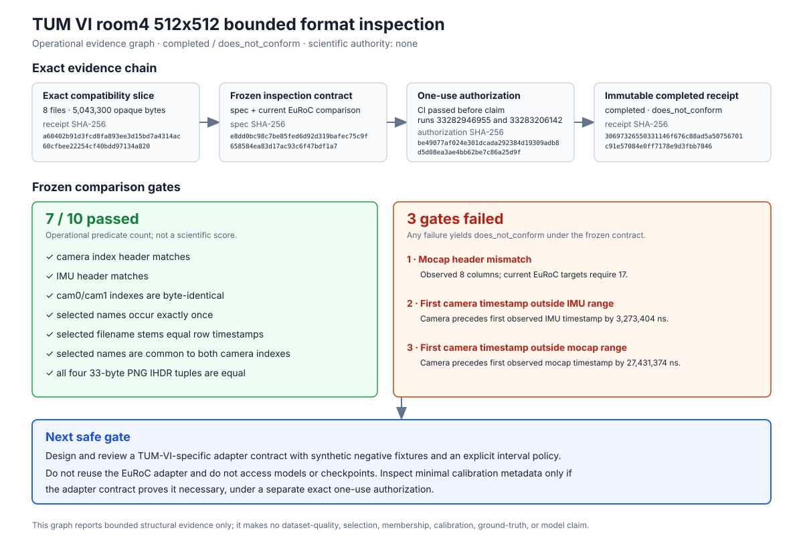

# TUM VI room4 512x512 bounded format inspection

Review date: 2026-08-29 (America/Toronto; execution evidence recorded in UTC on
2026-08-30)

Status: Completed operational inspection; `does_not_conform`; adapter,
calibration, and ground-truth readiness false; scientific authority none

## Answer

The separately authorized one-use inspection completed, but the exact bounded
slice does **not** conform to the frozen comparison contract. Three frozen
conditions prevent acceptance:

1. the observed eight-column `mocap0` header matches neither permitted
   17-column full-state reference header used by the current EuRoC adapter;
2. the first selected camera timestamp is 3,273,404 ns before the first
   observed IMU timestamp; and
3. the same camera timestamp is 27,431,374 ns before the first observed mocap
   timestamp.

The camera indexes and IMU structure conform. Both selected PNG names occur
exactly once in each camera index, their stems equal their row timestamps, the
two indexes are byte-identical, and all four inspected PNG signature/IHDR
records conform to the frozen 512x512, 16-bit header contract. Those passing
facts do not override the failed gates.

The result is a completed negative format comparison, not an operational
failure. It does not select TUM VI, establish source membership, authorize reuse
of the EuRoC adapter, approve calibration or ground truth, or permit any model,
checkpoint, training, inference, evaluation, or publication work.



The `7/10` count in the graph is only the number of frozen operational
comparison gates that passed. It is not a scientific score or a claim about
dataset quality.

## Evidence identity and CI gates

- Implementation commit:
  `b83eebf3cc24cfada57d2d76da4a19672ef8267a`
- Implementation GitHub Actions:
  [run 33282946955](https://github.com/laxman-kc/compact-vio-uav/actions/runs/33282946955),
  successful before authorization
- Authorization and execution revision:
  `7dfe85b8c7a3de04a1c789a79a139fa90ad5d5a4`
- Pre-execution GitHub Actions:
  [run 33283206142](https://github.com/laxman-kc/compact-vio-uav/actions/runs/33283206142),
  successful before the one-use claim was created
- [Authorization](../governance/datasets/acquisitions/tumvi-room4-512-16-format-inspection-2026-08-29.authorization.json),
  SHA-256
  `be49077af024e301dcada292384d19309adb8d5d08ea3ae4bb62be7c86a25d9f`
- [Checked inspection specification](../configs/data/tumvi_room4_512_16_format_inspection_v1.json),
  SHA-256
  `e8dd0bc98c7be85fed6d92d319bafec75c9f658584ea83d17ac93c6f47bdf1a7`
- [Completed receipt](../governance/datasets/acquisitions/tumvi-room4-512-16-format-inspection-2026-08-29.receipt.json),
  16,879 bytes, SHA-256
  `30697326550331146f676c88ad5a50756701c91e57084e0ff7178e9d3fbb7846`
- Consumed ignored claim:
  `data/quarantine/tum-vi/room4-512-16/format-inspection.claim.json`, SHA-256
  `cfec13978853239e5517d0c06d298191adebbe5d4d954d9604b51ef2ddb379ff`
- Bound compatibility-slice receipt SHA-256:
  `a60402b91d3fcd8fa893ee3d15bd7a4314ac60cfbee22254cf40bdd97134a820`
- Bound compatibility-slice report SHA-256:
  `b1f4a346eeedd9d8dbadf92bf8042754d5ef640626cf4931265b1efa4b4c966e`
- Bound candidate SHA-256:
  `0de942674afcadd2f768385a82c52b8cb65eea14d5e8c4d17dc9e48262023740`
- Bound current EuRoC adapter SHA-256:
  `bfcddb06e7516d148253e8db38a7247ce51064ef13c28b934cdbb3980fc238fd`

The authorization bound controller SHA-256
`a1cb881bfeed74b22f601157515fe69866f3b133e4bedb74496fcfa30e99d748`,
pure format-inspection primitive SHA-256
`c69bbe867c6a01e44f2203f6356d0381ce3afa2d139af83a8f4cfc10ac3c1a96`,
and acquisition-helper SHA-256
`6896f0fdd130e78ada923b2df48d16c8ee84f84f6429090759678c16b02734e7`.

## Bounded methodology

The controller operated only on the exact eight files and 5,043,300 opaque
bytes already published by the compatibility-slice receipt. Before its
permanent one-use claim, it required the active authorization, clean tracked
`HEAD`, exact tracked specification/evidence/tool bytes, an ignored and exact
single-link source tree, absent outputs, sufficient capacity, and an available
hard elapsed-time signal.

After the claim, the controller:

- streamed four CSV files under fixed row and line-byte limits;
- retained structural observations and bounded issue counts, not sensor rows or
  numeric sample values;
- interpreted exactly the first 33 bytes of each of four PNG files, covering
  only the PNG signature and IHDR record;
- recomputed exact opaque file hashes and rechecked descriptor-bound metadata;
- compared only the predicates frozen in the checked specification; and
- published the trackable receipt last, without replacement, after repeated
  source, claim, Git, deadline, and receipt truth gates.

No network or archive access occurred. The controller did not follow links,
read `dso`, copy or re-extract files, decode or decompress images, access
unlisted files, retain sensor values, infer units/frames/calibration/reference
semantics, correct synchronization, load dataset samples, assign membership,
select a dataset, load a model/checkpoint, train, infer, evaluate, publish a
scientific result, or modify/delete source evidence.

## Observed CSV structures

| Stream | Arity | Rows | First timestamp (ns) | Last timestamp (ns) | Gap count | Minimum gap (ns) | Maximum gap (ns) | Total gap (ns) | Result |
|---|---:|---:|---:|---:|---:|---:|---:|---:|---|
| `cam0_index` | 2 | 2,228 | 1520531124150444163 | 1520531235504118338 | 2,227 | 48,306,702 | 51,727,965 | 111,353,674,175 | conforms |
| `cam1_index` | 2 | 2,228 | 1520531124150444163 | 1520531235504118338 | 2,227 | 48,306,702 | 51,727,965 | 111,353,674,175 | conforms |
| `imu_stream` | 7 | 22,212 | 1520531124153717567 | 1520531235555397567 | 22,211 | 4,995,000 | 5,036,000 | 111,401,680,000 | conforms |
| `mocap_stream` | 8 | 13,075 | 1520531124177875537 | 1520531235544541537 | 13,074 | 8,333,000 | 483,334,000 | 111,366,666,000 | `header_mismatch` |

All four streams have `utf8_bom_present: false`. For every stream,
`valid_timestamp_count` equals `row_count`, `gap_count` equals
`row_count - 1`, and `total_gap_ns` equals the difference between the last and
first timestamp. Every recorded fault count is zero: invalid or int64-exceeding
timestamp lexemes, duplicate or out-of-order timestamps, blank or ragged rows,
unexpected comment rows, invalid or non-finite numeric fields, unsafe camera
filenames, and duplicate camera filenames were not observed.

The exact camera header is:

```text
#timestamp [ns],filename
```

The exact IMU header is:

```text
#timestamp [ns],w_RS_S_x [rad s^-1],w_RS_S_y [rad s^-1],w_RS_S_z [rad s^-1],a_RS_S_x [m s^-2],a_RS_S_y [m s^-2],a_RS_S_z [m s^-2]
```

The observed mocap header is:

```text
#timestamp [ns],p_RS_R_x [m],p_RS_R_y [m],p_RS_R_z [m],q_RS_w [],q_RS_x [],q_RS_y [],q_RS_z []
```

The frozen current-adapter comparison permits two 17-column full-state targets.
They differ only in whether the first token is `#timestamp` or
`#timestamp [ns]`; both then require position, quaternion, velocity, gyroscope
bias, and accelerometer bias columns. The observed eight-column mocap header
matches neither target. Column labels are byte observations here; their names
do not establish units, frames, calibration, or reference semantics.

## Cross-file predicate results

The two selected PNG basenames are
`1520531124150444163.png` and `1520531124200446163.png`.

| Frozen predicate | Result | Receipt-backed reason |
|---|---|---|
| `cam0_cam1_index_bytes_equal` | pass | Both indexes are 98,057 bytes with SHA-256 `feff54e5a721df968901ae0ec5af1d6ca45c12e758ef8e9e965b812ca87c8d67`. |
| `selected_png_names_present_once_in_own_index` | pass | Both occurrence vectors are `[1, 1]`. |
| `selected_filename_stem_equals_row_timestamp` | pass | Both selected stems equal their observed row timestamps. |
| `selected_names_common_to_both_camera_indexes` | pass | Both indexes contain the same two required basenames. |
| `selected_camera_timestamps_within_observed_imu_range` | **fail** | The first selected timestamp precedes the first IMU timestamp by 3,273,404 ns; the second is inside the range. |
| `selected_camera_timestamps_within_observed_mocap_range` | **fail** | The first selected timestamp precedes the first mocap timestamp by 27,431,374 ns; the second is inside the range. |
| `four_png_ihdr_tuples_equal` | pass | All four bounded IHDR tuples are identical. |

The failed range predicates are literal interval-membership observations. They
do not diagnose clock offset, synchronization error, sample loss, or the
correct inclusion policy.

## Observed PNG signature and IHDR records

| Role | Whole-file opaque bytes | Interpreted bytes | Width | Height | Bit depth | Color type | Compression | Filter | Interlace | IHDR CRC32 | Result |
|---|---:|---:|---:|---:|---:|---:|---:|---:|---:|---:|---|
| `cam0_png_0` | 284,188 | 33 | 512 | 512 | 16 | 0 | 0 | 0 | 0 | 2172868453 | conforms |
| `cam1_png_0` | 283,001 | 33 | 512 | 512 | 16 | 0 | 0 | 0 | 0 | 2172868453 | conforms |
| `cam0_png_1` | 283,946 | 33 | 512 | 512 | 16 | 0 | 0 | 0 | 0 | 2172868453 | conforms |
| `cam1_png_1` | 282,511 | 33 | 512 | 512 | 16 | 0 | 0 | 0 | 0 | 2172868453 | conforms |

All four observations have no PNG-header violation and were compared with the
[W3C PNG Third Edition recommendation](https://www.w3.org/TR/2025/REC-png-3-20250624/),
bound as `W3C-PNG-Third-Edition-2025-06-24`. Whole-file PNG validity, decodability,
pixel values, preprocessing, and the full indexed image population were not
checked. Full-file size and SHA-256 bind opaque source identity only.

## Timing, capacity, and cost

| Observation | Exact value |
|---|---:|
| Controller started | `2026-08-30T00:24:14Z` |
| Receipt prepared | `2026-08-30T00:24:15Z` |
| Elapsed time at receipt preparation | `0.2793292919814121` seconds |
| Maximum authorized elapsed time | 600 seconds |
| Initial free bytes | 94,684,848,128 |
| Free bytes before receipt | 94,684,831,744 |
| Authorized minimum free bytes | 2,149,580,800 |
| Retained post-inspection reserve | 2,147,483,648 bytes |
| Maximum claim bytes | 1,048,576 |
| Maximum receipt bytes | 1,048,576 |
| Controller-initiated paid-service cost | USD 0 |
| Retention review | `2026-09-07T00:18:53Z` |

The receipt is 16,879 bytes and is below the authorized 1 MiB bound. The four
CSV streams contain 39,743 total rows; each is below the per-file 1,000,000-row
bound. The receipt does not publish sensor values or an observed maximum line
length; it records the authorization's 1,048,576-byte line bound and the
controller's completed bounded outcome.

## Observed-versus-inferred boundary

Observed and receipt-backed:

- exact source paths, sizes, opaque SHA-256 values, and an exact eight-file
  source tree;
- the four CSV headers, arities, row counts, timestamp boundaries, gap
  summaries, BOM flags, bounded issue counts, and two required camera-name
  occurrence vectors;
- exact byte equality of the two camera index files;
- the seven frozen cross-file predicate results;
- exactly four 33-byte PNG signature/IHDR observations and their header fields;
- exact authorization/tool/source identities, timing, capacity, operations,
  outcome, readiness flags, and authority boundary.

Not observed or inferred:

- physical units, coordinate frames, transform direction, clock relationships,
  calibration validity, or ground-truth meaning;
- whole-file PNG validity, decoding, pixel values, preprocessing, or complete
  indexed-image existence;
- a cause or correction for the two timestamp-range failures;
- dataset fitness, representativeness, leakage/source grouping, scientific
  selection, or train/validation/test membership;
- compatibility with a TUM-VI-specific adapter that does not yet exist;
- model quality, checkpoint compatibility, training, inference, evaluation,
  publication, deployment, or UAV-domain generalization.

## Decision and readiness

The receipt records:

- `execution_outcome: completed`;
- `format_comparison_outcome: does_not_conform`;
- `adapter_ready: false`;
- `calibration_ready: false`;
- `ground_truth_ready: false`; and
- `scientific_authority: none`.

The current EuRoC adapter must not be reused for this TUM VI slice. No model or
checkpoint work may proceed from this result.

## Falsifiable next gates

The next safe slice is a **TUM-VI-specific adapter contract**, not an execution
against a model. It must be reviewed and versioned separately and must fail
closed unless all of these conditions are explicit and synthetically tested:

1. exact accepted camera, IMU, and eight-column mocap header grammars;
2. row-arity, numeric-token, timestamp-order, duplicate, filename, and bounded
   resource behavior;
3. a predeclared camera/IMU/mocap interval policy that explains whether an
   out-of-range camera row is rejected or excluded, without extrapolation,
   resampling, correction, or outcome-driven adjustment;
4. explicit output records that preserve source timestamps and identities and
   do not silently claim units, frames, synchronization, calibration, or
   ground-truth semantics; and
5. negative fixtures proving EuRoC full-state mocap rows are not silently
   conflated with the observed TUM VI eight-column rows.

Only if that contract identifies a necessary, minimal calibration dependency
may a **separate one-use authorization** inspect exact calibration metadata. It
must freeze the source paths/hashes, fields allowed to be read, transforms and
clock claims under review, byte/resource limits, output evidence, and
prohibited inference. Ambiguous, missing, inconsistent, or broader-than-needed
metadata must leave calibration and ground-truth readiness false.

After those independent gates, a new authorization and receipt would still be
required to establish adapter readiness. Dataset selection, source membership,
leakage review, and a frozen full-pose evaluation protocol remain separate
decisions before any model/checkpoint access, training, inference, or
evaluation.

## Fixed limitations

- The four PNG observations are deterministic headers, not the image
  population.
- CSV structure does not establish units, frames, or semantics.
- PNG IHDR inspection does not establish whole-file validity, decodability, or
  preprocessing.
- Full indexed-image existence was not checked in the sparse slice.
- Mocap reference semantics and calibration remain uninterpreted.
- The result does not select a dataset or assign membership.
- The result does not approve model access, training, inference, evaluation,
  or publication.

## Further questions

- Which exact camera, IMU, and eight-column mocap grammars should the
  TUM-VI-specific adapter accept, and which near-matches must it reject?
- What predeclared interval policy should handle a selected camera timestamp
  before the first observed IMU or mocap timestamp without extrapolation,
  resampling, synchronization correction, or outcome-driven adjustment?
- Which exact minimal calibration fields, if any, does that adapter contract
  prove necessary, and what separate authorization would bound their review?
- What separately frozen policy will govern 16-bit PNG validity, decoding,
  numeric range, and preprocessing before any sample or model access?
