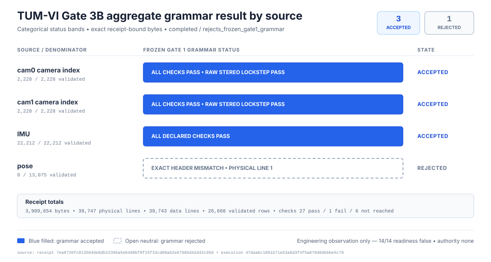

# TUM VI room4 512x512 real-CSV grammar-probe result

Review date: 2026-08-30

Status: Completed aggregate engineering observation; frozen Gate 1 grammar
rejected at the pose exact-header gate; one earlier authorization consumed with
zero payload descriptors opened and no receipt; every readiness field false;
scientific authority none

## Technical summary

The superseding one-use Gate 3B execution completed and produced a checked
aggregate receipt. All four receipt-bound source identities passed. The `cam0`,
`cam1`, and `imu` streams accepted the frozen Gate 1 grammar: the cameras each
validated 2,228 of 2,228 data rows and passed raw-byte stereo lockstep, while
the IMU validated 22,212 of 22,212. The pose stream rejected at
`exact_header_mismatch` on physical line 1; it contained 13,075 data lines,
validated zero rows, and did not reach later pose grammar checks. The terminal
result is therefore `completed` / `rejects_frozen_gate1_grammar`.

This is a narrow compatibility observation, not adapter or dataset readiness.
The checked receipt contains aggregate counts and finite check states plus
source identity/path and execution/capacity metadata. It does not persist or
emit source rows, row tokens, sensor timestamps, observed header text,
filenames from row values, or numeric sensor values. The post-run auditor loaded
the checked receipt without reopening any source. All 14 readiness fields are
false and scientific authority is `none`.

An earlier authorization record dated 2026-08-29 was consumed by an
auditor-observed preflight at `2026-08-30T06:26:18Z`. The controller published
its durable claim before entering a wholly mocked source binder; that mock
raised at entry, so the binder body and all four payload descriptor opens were
never reached. No receipt exists for that attempt and the authorization cannot
be retried. This zero-payload operational incident is evidence about one-use
claim semantics, not a grammar result. A recovery revision and a separately
reviewed, committed, pushed, and CI-green superseding authorization preceded
the operationally completed execution.

## Three streams accepted; pose rejected at its first grammar gate

The graphic compares categorical grammar states at the four fixed source roles;
equal-width status bands do not encode row volume. Exact denominators are shown
in the labels. The rejected pose result stops at the exact-header check and does
not reveal or reconstruct the observed header.

| Source role | Bytes / physical lines / data lines / validated rows | Identity and check result | Grammar state |
|---|---:|---|---|
| `cam0` | 98,057 / 2,229 / 2,228 / 2,228 | SHA-256 `feff54e5a721df968901ae0ec5af1d6ca45c12e758ef8e9e965b812ca87c8d67`; every declared check passed, including raw stereo lockstep | `accepted` |
| `cam1` | 98,057 / 2,229 / 2,228 / 2,228 | SHA-256 `feff54e5a721df968901ae0ec5af1d6ca45c12e758ef8e9e965b812ca87c8d67`; every declared check passed, including raw stereo lockstep | `accepted` |
| `imu` | 2,232,296 / 22,213 / 22,212 / 22,212 | SHA-256 `4249d4036b3c03c55b709f6f634d975d024999fb017ab3539cfa71580793a3be`; every declared check passed | `accepted` |
| `pose` | 1,481,244 / 13,076 / 13,075 / 0 | SHA-256 `073a3e957efa8ff638ea41402cac9654b40897631d566a3ffee090208597db2a`; source identity passed, exact header failed at physical line 1, and all later grammar checks were `not_reached` | `rejected` |
| **Total** | **3,909,654 / 39,747 / 39,743 / 26,668** | **27 `pass`, 1 `fail`, 6 `not_reached` check states** | **`rejects_frozen_gate1_grammar`** |

The receipt records source-derived observations only at aggregate granularity.
The validated-row total is not an acceptance rate, dataset-quality score, or
scientific sample count: pose rows were intentionally not evaluated after the
first exact-header failure.

## The terminal records bind one exact execution

| Record or execution gate | Exact evidence |
|---|---|
| [Superseding authorization](../governance/datasets/acquisitions/tumvi-room4-512-16-real-csv-grammar-probe-2026-08-30.authorization.json) | SHA-256 `5f566515e723a0e51abd09b75cd43b68d6aa61807749d5069a49427aa218126f`; 5,756 bytes; authorized `2026-08-30T06:36:02Z`; expires `2026-08-31T06:36:02Z`; one execution, 600 seconds, USD 0 |
| Authorization revision | `47daabc1891b71e53a6d3f4f5a070d69bbbe5c78`; pushed; its parent `abd7af3d77c12637144b324465ab462752629872` contains the recovery code and differs from it only by the superseding authorization |
| Recovery-code CI | [run 33297224165](https://github.com/laxman-kc/compact-vio-uav/actions/runs/33297224165), success on the exact parent revision |
| Authorization-revision CI | [run 33297367015](https://github.com/laxman-kc/compact-vio-uav/actions/runs/33297367015), success; Python jobs `99219236016` and `99219236078` succeeded |
| [Durable claim](../governance/datasets/acquisitions/tumvi-room4-512-16-real-csv-grammar-probe-2026-08-30.claim.json) | SHA-256 `beba4617be76bf63870ff0957c0d4b187abe2caf7fcc6f0b336bf2b6fcc53403`; 1,012 bytes; canonical JSON; regular file with link count 1; prepared `2026-08-30T06:39:58Z` before payload access |
| [Aggregate receipt](../governance/datasets/acquisitions/tumvi-room4-512-16-real-csv-grammar-probe-2026-08-30.receipt.json) | SHA-256 `7ea8720fc013504de8db22396a5eb4d8bf8f25f33cd00ab2e6798bd42d42c958`; 8,259 bytes; canonical JSON; regular file with link count 1; prepared `2026-08-30T06:39:58Z`; checked loader passed |
| Execution revision | `47daabc1891b71e53a6d3f4f5a070d69bbbe5c78` |
| Frozen probe specification | SHA-256 `e65ecc449ca878f9294dcb11accd6eb555232af284ad38f608cfc35c4642f790` |
| Executed controller | SHA-256 `89f1871d935382e9010b879b4f36caae5107257776ece449da12f70347eacad3` |
| Acquisition support module | SHA-256 `6896f0fdd130e78ada923b2df48d16c8ee84f84f6429090759678c16b02734e7` |
| Frozen Gate 1 contract | SHA-256 `4368580eb601958f1c402ee6f85d3207d9bb41282c51f4dee505482c1a6542d5` |
| Timing and cost | Receipt prepared after 0.9046070000040345 seconds, within the 600-second authorization bound; controller-initiated paid-service cost USD 0 |
| Independent post-run audit | Final hash-bound PASS; no P0, P1, or P2 finding; checked receipt loader used without source reopen |

The design report's controller SHA-256
`677197c4d0bc6573a2102495fa0491289a356ae655b21da364e8f701d4603a93`
identifies the original implementation-and-CI freeze. The executed controller
identity differs because the separately reviewed recovery revision followed the
zero-payload claim incident. This result report binds the actual execution
identity rather than silently treating the earlier implementation hash as the
executed byte sequence.

## The first authorization was consumed without a payload descriptor open

| Incident evidence | Exact fact |
|---|---|
| [Original authorization](../governance/datasets/acquisitions/tumvi-room4-512-16-real-csv-grammar-probe-2026-08-29.authorization.json) | SHA-256 `9893cc16ce13db037d3179487c9bb37d93ffb0dc068d7b86bdd1480a36b84ef0`; 5,613 bytes; authorized `2026-08-30T06:21:00Z`; execution revision `4390ada9d9f138220fb528162b1a1ecf6e37fb6f` |
| Original-authorization CI | [run 33296869742](https://github.com/laxman-kc/compact-vio-uav/actions/runs/33296869742), success |
| [Consumed incident claim](../governance/datasets/acquisitions/tumvi-room4-512-16-real-csv-grammar-probe-2026-08-29.claim.json) | SHA-256 `f63263fd0b9f086075b7002c4b4e5dd2ca30112587a7c1b31966e9557afae490`; 1,012 bytes; prepared `2026-08-30T06:26:18Z`; ordinal 1; payload state `not_started_at_claim_publication` |
| Descriptor-access evidence | Auditor-observed runtime fact: the entire source binder was monkeypatched to raise at entry, so its body and all four source opens were never reached |
| Terminal state | Original receipt absent; claim retained; authorization consumed; no retry |

The durable claim and absent receipt are persisted evidence. The zero-descriptor
fact additionally depends on the auditor-observed mocked runtime; it is not
misrepresented as a receipt-backed source observation. No grammar acceptance or
rejection exists for the consumed incident.

## The completed probe stayed within its bounded method

The superseding controller first validated the exact authorization, Git and
tracked-evidence truth, output absence, source-root policy, capacity, and time
window. It atomically published and revalidated the durable claim before the
first payload descriptor open. It then opened only the four bound regular,
single-link CSV files through no-follow descriptor traversal; verified their
size, SHA-256 identity, and stability; hashed and scanned each once with bounded
state; compared camera index bytes in raw lockstep; revalidated claim, source,
Git, runtime, and capacity truth; and atomically published the aggregate
receipt.

The receipt records exactly seven performed operations:

1. write the claim;
2. open the exact four bound CSV descriptors after the claim;
3. verify all four source identities in one pass;
4. scan the strict Gate 1 grammar in one pass;
5. compare camera indexes in raw lockstep;
6. revalidate claim, source, Git, and runtime truth; and
7. write the aggregate receipt.

It records 26 prohibited operations as not performed, including network or
archive access, calibration or PNG access, opening an unlisted file, following
links, source mutation or deletion, source-row/value persistence, numeric
conversion or semantic interpretation, Gate 2 real-payload reuse, image decode,
segment construction, dataset selection or membership, model/checkpoint access,
training, inference, evaluation, publication, and deployment.

## Capacity and privacy checks passed without granting readiness

| Capacity field | Exact receipt value |
|---|---:|
| Authorized minimum free bytes | 2,149,580,800 |
| Initial free bytes | 95,471,804,416 |
| Free bytes before receipt | 95,471,792,128 |
| Maximum claim bytes | 1,048,576 |
| Maximum receipt bytes | 1,048,576 |
| Required retained reserve | 2,147,483,648 |

The scanner could transiently hold bounded line, cell, and previous-timestamp
state while evaluating a source. Persisted and emitted evidence is narrower:
fixed role and path identities, source size and SHA-256, aggregate byte/line/row
counts, check states, first-failure code and physical line, and execution,
capacity, Git, and governance bindings. Source row contents and lexemes were not
persisted or emitted.

## The negative grammar result opens no downstream gate

The result establishes only that the exact receipt-bound bytes do not all
conform to the exact frozen Gate 1 grammar. It does not establish or authorize:

- the observed pose header text or a replacement contract;
- pose units, frame, transform direction, reference meaning, or ground-truth
  role;
- clock equivalence, synchronization correction, association, interpolation,
  gap policy, or segment construction;
- calibration access or camera/IMU/pose calibration relationships;
- PNG population, validity, decoding, channel meaning, range mapping,
  normalization, or preprocessing;
- a reusable real-payload parser, adapter implementation, or adapter readiness;
- dataset selection, source grouping, leakage review, or membership;
- model/checkpoint access, training, inference, evaluation, publication,
  deployment, or UAV-domain generalization.

The receipt's 14 readiness fields—adapter implementation/readiness,
calibration, clock mapping, dataset selection, full image population,
ground-truth, membership, model access, PNG decoding, pose semantics,
preprocessing, terminal real-payload authorization, and segment
construction—are all false. Scientific authority is `none`.

## Next step: review the contract mismatch without guessing the header

1. Preserve both claims, the superseding aggregate receipt, and the fact that
   both authorizations are consumed. Do not retry either authorization.
2. Treat `exact_header_mismatch` at pose physical line 1 as a stopping
   condition for Gate 1 and Gate 2 reuse on these real bytes. Do not implement a
   real adapter or broaden the existing grammar from this aggregate result.
3. Open a separate reviewed contract-reconciliation decision. It may keep the
   frozen contract unchanged and stop this candidate lane; this report does not
   silently choose an amendment.
4. If reconciliation requires any source re-access or additional source
   observation, define a new minimal evidence boundary and obtain a new exact
   one-use authorization that is independently reviewed, committed, pushed,
   and CI-green before execution. Do not reconstruct or guess the observed
   header from the failure code.
5. Keep calibration, image, clock/pose semantics, segment, dataset-membership,
   and all model gates closed unless later independent evidence and authority
   explicitly open them.

## Further questions

- Is stopping the TUM-VI candidate lane safer and more decision-useful than
  designing a separately governed contract-reconciliation gate?
- What is the smallest additional evidence that could resolve the pose header
  mismatch without granting broader payload access or semantic authority?
- If a new grammar is ever proposed, which synthetic negative corpus and
  cross-gate identity checks must be frozen before any further real-payload
  observation?
