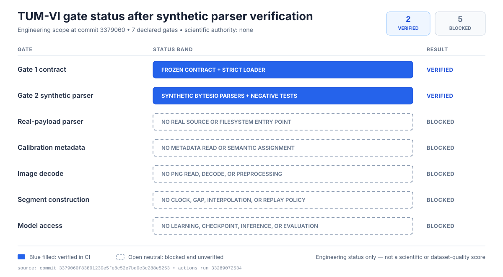

# TUM VI room4 512x512 synthetic parser Gate 2

Review date: 2026-08-29 (America/Toronto; CI evidence recorded in UTC on
2026-08-30)

Status: Synthetic-only CSV parsers implemented, pushed, and CI-green on Python
3.10 and 3.12; no real data opened by Gate 2; every operational readiness flag
false; scientific authority none

## Technical summary

Gate 2 is complete at its declared synthetic-only boundary. Pushed commit
`3379060f83801230e5fe8c52e7bd0c3c288e5253` adds bounded parsers for exact
in-memory camera-index, IMU, eight-column source-labelled pose, and byte-identical
stereo-index fixtures. GitHub Actions
[run 33289072534](https://github.com/laxman-kc/compact-vio-uav/actions/runs/33289072534)
passed on Python 3.10 and 3.12. Focused tests passed 20/20; the full suite
reported `OK` across 537 tests with 54 declared optional-capability skips. Two
independent adversarial reviews reported no P0 or P1 finding.

The implementation opened no real TUM-VI data. It accepts only an exact open
`io.BytesIO` positioned at byte zero, has no filesystem loader or CLI, is not
exported through `compact_vio.data`, and imports no calibration, image, EuRoC,
learning, model, or segment module. It denies the three known inspected real
CSV SHA-256 identities before reading the supplied stream.

The synthetic origin label is nevertheless **not authenticated**. A caller
supplies the in-memory bytes and their claimed path/size/SHA-256; the parser
verifies those claims against the supplied bytes and frozen limits, but it
cannot prove where otherwise unknown bytes came from. A successful parse is
therefore lexical and structural evidence only, never real-payload acceptance,
adapter readiness, calibration, ground truth, or scientific authority.

## Two engineering gates are verified; five remain blocked

The chart shows the complete seven-category status declared for this closeout.
The two blue rows are the only gates verified by committed code and CI. The
five open rows remain blocked; their open styling is as important as their
labels. The `2/7` result is an engineering-status count, not a scientific score,
dataset-quality measure, or progress percentage.

| Declared gate | Status | Exact interpretation |
|---|---|---|
| Gate 1 contract | verified | Exact grammar/output policy and strict loader are pushed and CI-green. |
| Gate 2 synthetic parser | verified | Exact synthetic `BytesIO` fixtures are parsed or rejected under the frozen contract. |
| Real-payload parser | blocked | No filesystem or real-source entry point exists; known inspected real CSV hashes are denied. |
| Calibration metadata | blocked | No calibration file or field was opened, parsed, selected, or interpreted. |
| Image decode | blocked | No PNG payload was opened or decoded; decoder and preprocessing remain unset. |
| Segment construction | blocked | No clock mapping, gap threshold, association, interpolation, or replay segment was selected. |
| Model access | blocked | No learning import, checkpoint, inference, evaluation, or model authorization exists. |

The status figure has SHA-256
`7de56ac3e38ab9e70be85b4e746640bbafbcc75c77242f9d25c2ca6648568e48`.
It uses filled blue versus open neutral marks plus direct text labels, so status
does not depend on color alone. It intentionally uses no green/red encoding.

## Exact implementation and CI identity

| Artifact or gate | Exact result |
|---|---|
| Implementation revision | `3379060f83801230e5fe8c52e7bd0c3c288e5253`, pushed to `origin/main` |
| [Synthetic parser](../src/compact_vio/data/tumvi_adapter_parser.py) | SHA-256 `4d5186a9559a4c111edda6df3d49a1484952ab6028a9269904ce4577efdc99e1` |
| [Focused tests](../tests/test_tumvi_adapter_parser.py) | SHA-256 `9ba2ca8157af4a9e83a44d4e57e6737d272de845b6932bf6e84db0d8371cb69c`; 20/20 passed |
| Frozen Gate 1 contract | SHA-256 `4368580eb601958f1c402ee6f85d3207d9bb41282c51f4dee505482c1a6542d5` |
| Full repository suite | `OK` across 537 tests; 54 declared optional-capability skips |
| Ruff lint and format | lint passed; formatter checked 131 supported source/document files |
| Python compilation | passed |
| Schema harness | passed, 10 schemas and 7 templates |
| Repository policy | passed, 186 intended files and zero violations |
| `git diff --check` | passed |
| Independent review | two final reviews; no P0 or P1 finding |
| GitHub Actions | [run 33289072534](https://github.com/laxman-kc/compact-vio-uav/actions/runs/33289072534), success |
| Python 3.10 CI job | `99197374254`, success, `2026-08-30T02:54:54Z`–`02:55:14Z` |
| Python 3.12 CI job | `99197374357`, success, `2026-08-30T02:54:54Z`–`02:55:19Z` |

The workflow run was created and started at `2026-08-30T02:54:50Z` and reached
terminal success at `2026-08-30T02:55:20Z`. This closes only Gate 2's exact
source-and-CI evidence boundary.

## Accepted input is exact in-memory syntax, not an authenticated source

The four public parse functions accept synthetic camera, IMU, pose, or stereo
index bytes. Every call requires the exact loader-sealed Gate 1 contract, a
role-derived source-path label, an expected byte size, and an expected lowercase
SHA-256. The stream must be an exact `io.BytesIO`, not a subclass, must be open,
and must start at byte zero. On success it is consumed through EOF and left open.
On failure it is left open, but its position is intentionally unspecified.

The parser recomputes size and SHA-256 while reading. Total-byte accounting
includes the header and every LF byte; physical-line limits include the trailing
LF; row counts exclude the header. Reads are bounded by the remaining claimed
size, role-specific source ceiling, and line ceiling plus one byte so overruns
fail closed.

The frozen lexical rules remain exact:

- ASCII CSV with exact raw headers, LF-only lines, and a required final LF;
- no BOM, carriage return, NUL, quotes, blank/comment rows, whitespace repair,
  ragged rows, or extra columns;
- canonical nonnegative timestamp tokens through signed-int64 maximum, strictly
  increasing and unique;
- safe case-sensitive `<timestamp>.png` basenames whose stems equal timestamps;
- finite numeric ASCII lexemes no longer than 128 bytes, preserved without
  floating-point conversion; and
- at least one data row, at most 1,000,000 rows, at most eight columns, and at
  most 1,048,576 bytes per physical line including LF.

The stereo parser additionally requires two distinct `BytesIO` objects, equal
claimed identities, byte-identical headers and rows in lockstep, and simultaneous
EOF. There is no monocular fallback or row repair.

## Outputs preserve labels and remain sealed

Successful parses emit immutable, slots-only, parser-sealed row, source-identity,
and batch records. Camera rows retain stream role, integer timestamp token, and
filename lexeme. IMU and pose outputs retain original numeric ASCII lexemes.
The pose type is `TumviSourceLabeledPoseRow`; it does not project to ground
truth, normalize quaternions, fabricate velocity/bias, or assign frames,
transform direction, calibration, or physical reference meaning.

Every batch binds the exact Gate 1 contract identity and accounting-policy ID,
sets `source_scope` to
`synthetic-fixture-only-origin-not-authenticated/v1`, and fixes
`scientific_authority` to `none`. Direct construction, dataclass replacement,
forged nested contract state, foreign callback-bearing objects, shared/cyclic
composites, and authority mutation are rejected.

The fixed synthetic source identity is a safety label, not provenance
authentication. In particular:

- the `source_path` is a contract-derived label and is never opened;
- expected size/SHA-256 are caller inputs that are verified against the supplied
  bytes, not against an external source system; and
- denial of known real hashes prevents the exact inspected real CSVs from this
  interface but does not prove that every other byte stream is synthetic.

## Known inspected real identities are denied before reading

Gate 2 rejects these receipt-backed real CSV identities before consuming one
byte from the supplied stream:

| Inspected real source identity | SHA-256 |
|---|---|
| Byte-identical camera indexes | `feff54e5a721df968901ae0ec5af1d6ca45c12e758ef8e9e965b812ca87c8d67` |
| IMU CSV | `4249d4036b3c03c55b709f6f634d975d024999fb017ab3539cfa71580793a3be` |
| Mocap CSV | `073a3e957efa8ff638ea41402cac9654b40897631d566a3ffee090208597db2a` |

This denylist is a deliberate guardrail, not a real-source authenticator or a
general content-classification system.

## The test boundary is adversarial and filesystem-free

The 20 focused tests cover accepted camera, IMU, source-labelled pose, and
stereo fixtures plus failure behavior for source type/state, exact contract
identity, forged nested state, source labels and identities, known real hashes,
transport bytes, headers, arity, timestamps, filenames, numeric lexemes,
minimum/maximum bounds, unequal stereo content/EOF, record forgery, and
authority escalation.

An import-graph assertion permits only standard-library dataclasses, hashing,
in-memory I/O, regular expressions, and the Gate 1 contract module. It rejects
filesystem, dynamic-code, EuRoC, image, learning/model, and downstream imports.
Execution is also tested while `builtins.open` raises, proving that the exercised
parser path does not open a filesystem path.

No filesystem loader, command-line entry point, `compact_vio.data.__init__`
export, calibration/image parser, EuRoC bridge, learning/model dependency,
segment constructor, or replay integration was added.

## Limitations and authority remain unchanged

Gate 2 establishes only exact synthetic lexical/structural behavior. It does
not establish:

- acceptance, completeness, quality, or semantics of real TUM-VI payloads;
- authenticated source provenance for caller-supplied `BytesIO` objects;
- clock equivalence, synchronization correction, gap policy, or causal segment
  construction;
- camera/IMU calibration, frames, transforms, or pose-reference meaning;
- PNG existence, whole-file validity, decoding, sample range, channel meaning,
  normalization, or preprocessing;
- dataset selection, source grouping, leakage review, or membership;
- adapter/replay readiness, model access, checkpoint compatibility, training,
  inference, evaluation, publication, deployment, or UAV generalization.

All existing readiness flags remain false and scientific authority remains
`none`.

## Gate 3 requires a separate reviewed design decision

Gate 2 does not choose or authorize Gate 3. The next production decision must
review at least these two bounded alternatives before selecting either:

1. **Calibration-metadata evidence:** freeze the exact minimal metadata paths,
   fields, byte limits, transform/clock questions, output record, and failure
   behavior, then issue a separate one-use authorization only if that review
   justifies the read.
2. **One-use real-payload adapter probe:** freeze the exact CSV paths/hashes,
   parser revision, permitted reads, resource/time limits, output receipt,
   known-real-hash boundary change, and prohibited downstream operations before
   authorizing one bounded execution.

The alternatives answer different uncertainties and may have different risk.
This report does not rank, select, combine, or authorize them. A reviewed Gate 3
decision may also conclude that neither is yet justified.

## Further questions

- Which unresolved decision blocks the scientific lane first: calibration/clock
  semantics or real-payload grammar acceptance?
- What is the smallest exact evidence product that would resolve that decision
  without granting adapter, segment, dataset, or model authority?
- What additional provenance mechanism would be required before any future
  parser output could claim authenticated real-source identity?
